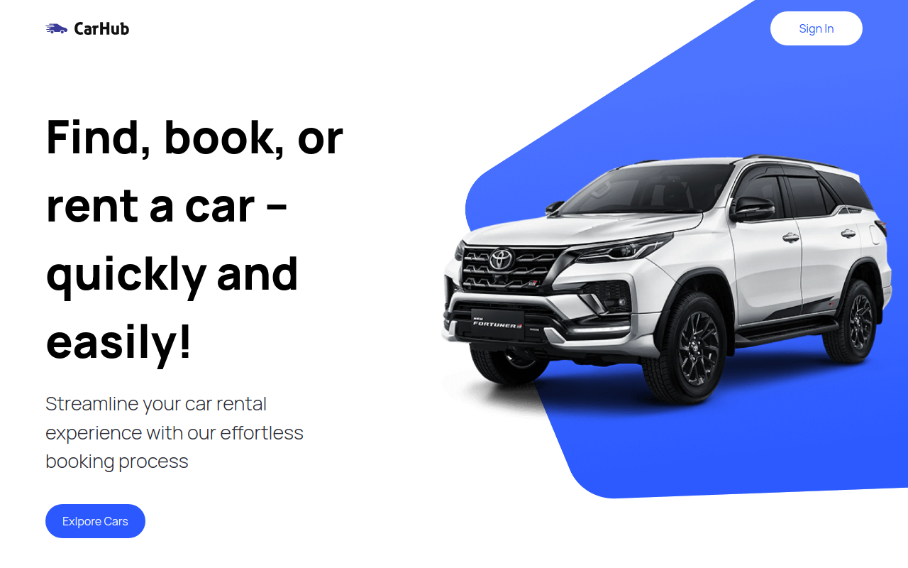

  <h1>
  Welcome To Car Hub!
</h1>
 

  
  
  
  

 

<pre style="font-size: 25px ; color: white;">
  I Create This project using :
  TypeScript
  Nextjs
  Reactjs 
  tailwindcss
  headless ui

  with real api data (rapid api)
  search , filtering by fuel and year ,
  and with amazing modals , ...
  You can try it and enjoy.!
</pre>

I Deployed it on vercel and You Can See it Online :  https://car-showcase-three-livid.vercel.app/

